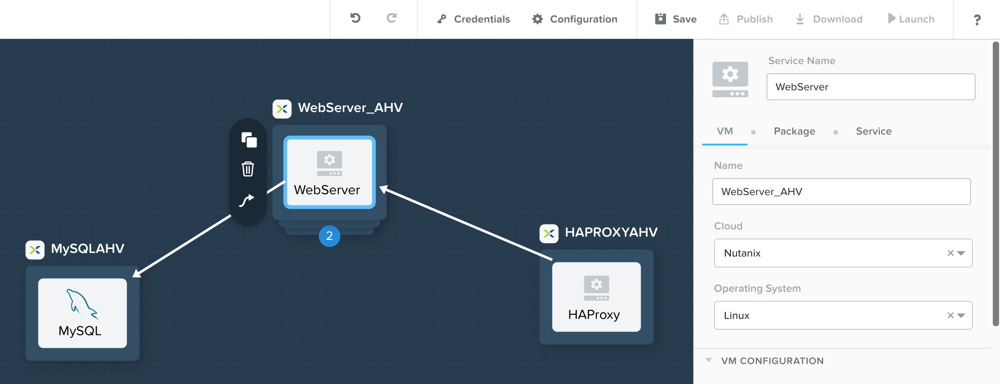
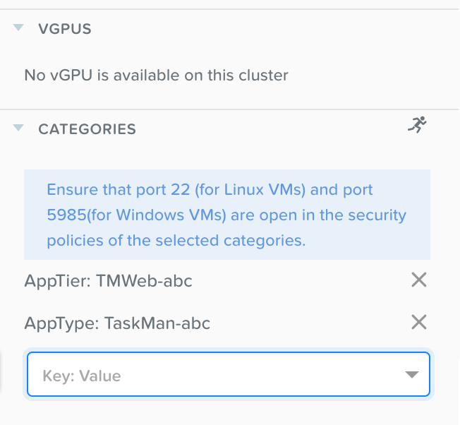

.. _flow_assign_categories_in_calm:

---------------------------------------------
Flow: Assign Categories inside Calm Blueprint
---------------------------------------------

Overview
++++++++

Assign Categories to the Calm Blueprint
+++++++++++++++++++++++++++++++++++++++

In **Prism Central > :fa:`fa-navicon` > Services > Calm**.

Click on Blueprints and select the **abc_TaskManager** blueprint you imported and edited earlier.

Click on the WebServer_AHV service in the blueprint pane > Click the **VM** tab in the right side menu.

Scroll down until you see the **CATEGORIES** section > Click **Key:Value** > Select **AppTier: TMWeb-abc** and **AppType: TaskMan-abc**.

Repeat the same steps with each of the services in the blueprint:
HAProxy -> AppTier: TMLB-abc and AppType: TaskMan-abc
MySQLAHV -> AppTier: TMDB-abc and AppType: TaskMan-abc
WindowsClient -> Environment: Dev

Takeaways
+++++++++

- Calm Blueprints can deploy applications that are automatically secured with Flow.
