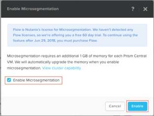

.. _flow_enable_and_lab_setup:

--------------------------
Flow: Enable and Lab Setup
--------------------------

Overview
++++++++

.. note::

  Estimated time to complete: 10-20 MINUTES

In this exercise you will enable Nutanix Flow and edit a blueprint within Calm that will be used to create an application that we will protect in the subsequent exercises.

Enabling Flow
++++++++++++++++++++++++++

Open https://<Prism-Central-IP>:9440/ in the Chrome browser and log in.

.. note::

  Do not use Firefox for the Flow policy steps in the following exercises.

From the navigation bar, click the question mark at the top right corner and expand the **New in Prism Central** section of the menu.

Click **Flow**.

Select the **Enable Flow** check box within the **Enable Flow** dialog box.

.. figure:: images/enable_flow.png

.. note::

  Flow can only be enabled once per Prism Central instance. If **Flow** displays a green check mark next to it, that means Flow has already been enabled for the Prism Central instance being used.

Click **Enable**

Takeaways
+++++++++

- Microsegmentation, part of Flow, is a decentralized security framework managed from Prism Central.
- Microsegmentation offers additional protection against malicious threats that originate from within the data center and spread laterally, from one machine to another.
- Once Flow is enabled in the cluster, VMs can be easily protected through Security Policies created in the Prism Central UI. These function as labels that can easily be applied to VMs without any additional network setup.
