.. _flow_secure_app:

----------------
Flow: Secure App
----------------

Overview
++++++++

.. note::

  Estimated time to complete: 15-30 MINUTES

In this exercise you will create a security policy to restrict communication between the application VMs.

Creating and Assigning Flow Categories
++++++++++++++++++++++++++++++++++++++

Create Categories
.................

Now lets update the **AppType** with a new category value of **TaskMan-initials**.

In **Prism Central > :fa:`fa-navicon` > Virtual Infrastructure > Categories**.

Select the check box beside **AppType**, then click **Actions > Update**.

Scroll down and click the plus sign beside the last entry.

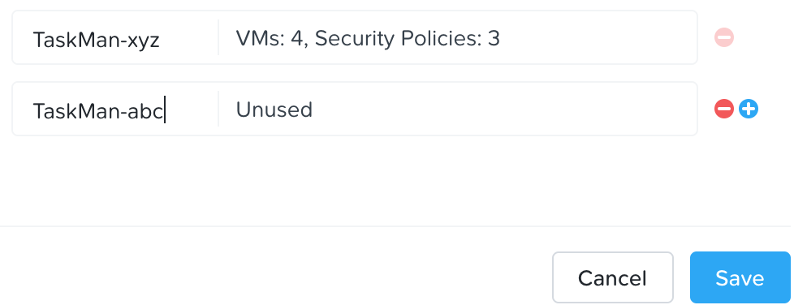

Enter **TaskMan-initials**, and click **Save**.

Now we need to update the **AppTier** with 3 New Category Values.

Select the check box beside **AppTier**, then click **Actions > Update**.

Scroll down and click the plus sign beside the last entry.

Enter **TMWeb-initials**, and repeat the steps for **TMDB-initials** and **TMLB-initials**.

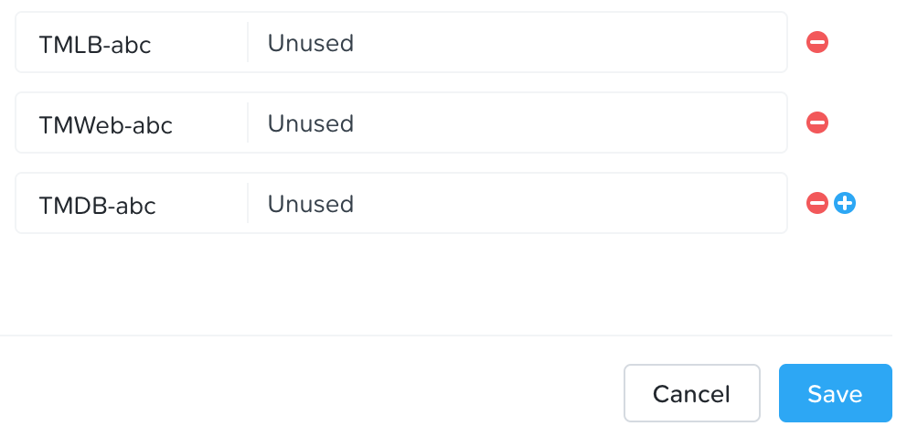

Click **Save**.

Assign Categories
.................

Now we need to assign categories to the VMs that make up our application.

In **Prism Central > :fa:`fa-navicon` > Virtual Infrastructure > VMs**.

Click the check box besides *initials*-WebServer-######### VM(s), then click **Actions > Manage Categories**.

In the Set Categories text box, type **AppType** and select **AppType: TaskMan-initials** from autocomplete

then click the plus sign, and type **AppTier** and select **AppTier: TMWeb-initials** from autocomplete

Click **Save**.

Click the check box besides *initials*-HAProxy-######### VM(s), then click **Actions > Manage Categories**.

In the Set Categories text box, type **AppType** and select **AppType: TaskMan-initials** from autocomplete

then click the plus sign, and type **AppTier** and select **AppTier: TMLB-initials** from autocomplete

Click **Save**.

Click the check box besides *initials*-MYSQL-######### VM(s), then click **Actions > Manage Categories**.

In the Set Categories text box, type **AppType** and select **AppType: TaskMan-initials** from autocomplete

then click the plus sign, and type **AppTier** and select **AppTier: TMDB-initials** from autocomplete

Click **Save**.

Click the check box besides *initials*-WindowsClient-######### VM(s), then click **Actions > Manage Categories**.

In the Set Categories text box, type **Environment** and select **Environment: Dev** from autocomplete

Click **Save**.

Secure the Task Manager Application
+++++++++++++++++++++++++++++++++++

Let's create a security policy to protect the Task Manager application.

In **Prism Central > :fa:`fa-navicon` > Virtual Infrastructure > Policies > Security Policies**.

Click **Create Security Policy > Secure an Application**.

Fill out the following fields and click **Next**:

- **Name** - AppTaskMan-*initials*
- **Purpose** - Protect the Task Manager application by restricting unnecessary access.
- **Secure this app** - AppType: TaskMan-*initials*.

Do **NOT** select the check box for the option **Filter the app type by category**.

Click **Next**

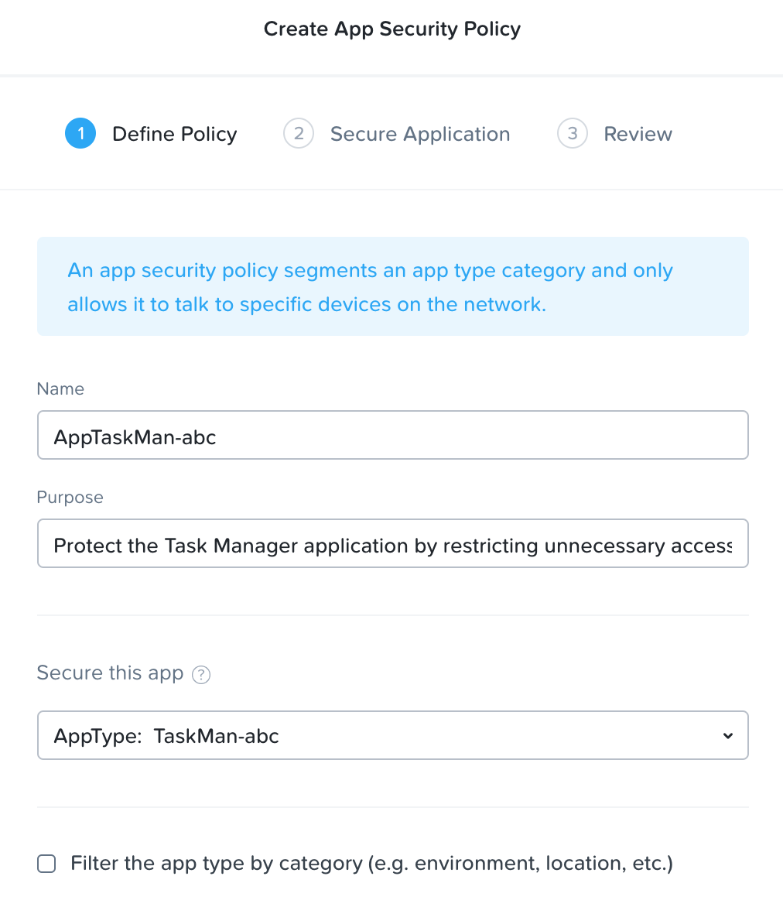

Click on **Ok, Got it!** if prompted with the tutorial diagram.

Add Tiers to Security Policy, click on **Set rules on App Tiers, instead**

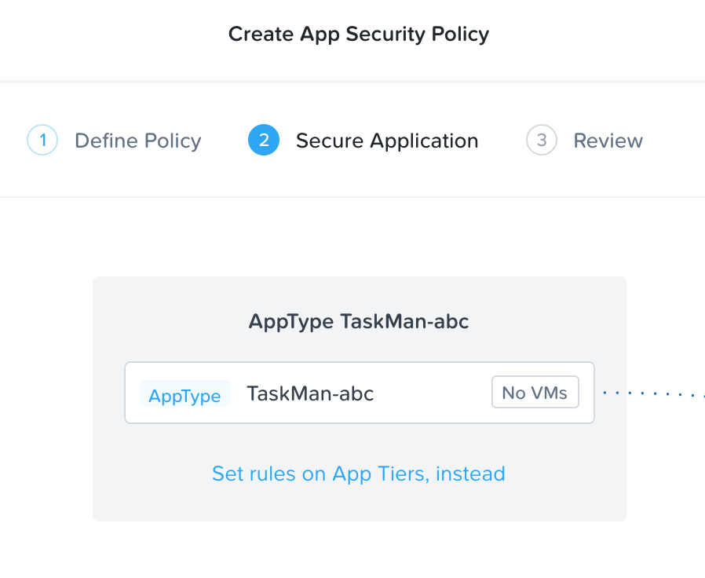

Click on **+ Add Tier**

Select **AppTier: TMLB-initials** from the drop down.

Repeat for **AppTier: TMWeb-initials** and **AppTier: TMDB-initials**

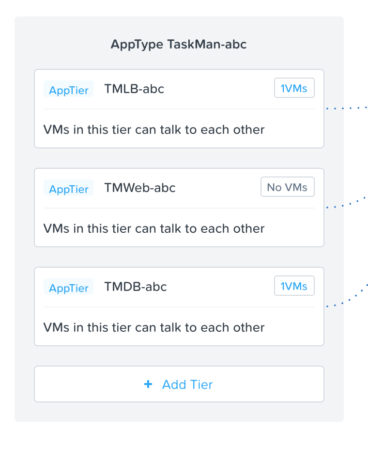

Add New Inbound Source Environment: Production
..............................................

In the Inbound rules section, allow incoming traffic from the production environment with the following steps:

- Leave **Whitelist Only** selected.
- Select **+ Add Source**.
- Leave **Add source by: Category** selected.
- Type **production** and select **Environment: Production**. Click Add.

Click + which appears on the left side of **AppTier: TMLB-initials**.

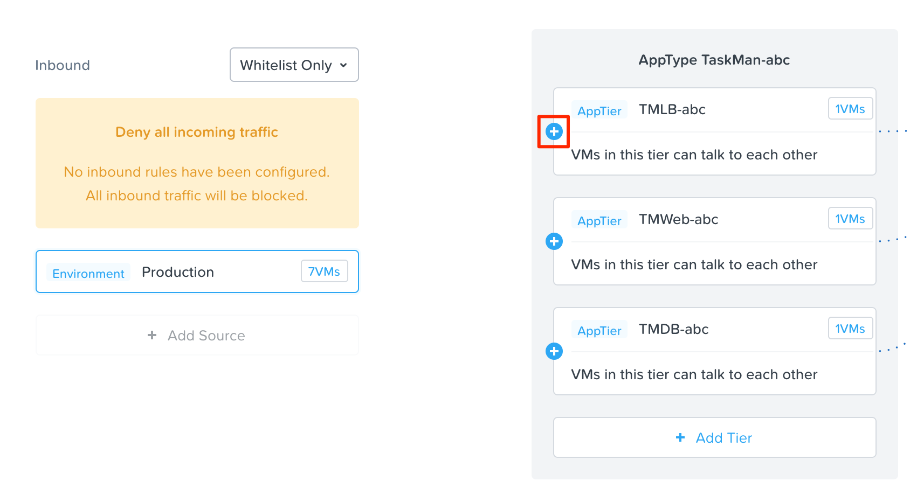

This opens the Create Inbound Rule window.

In the Protocol column, select **TCP** and type port 80 to allow web traffic into the load balancer.

Click **Save**.

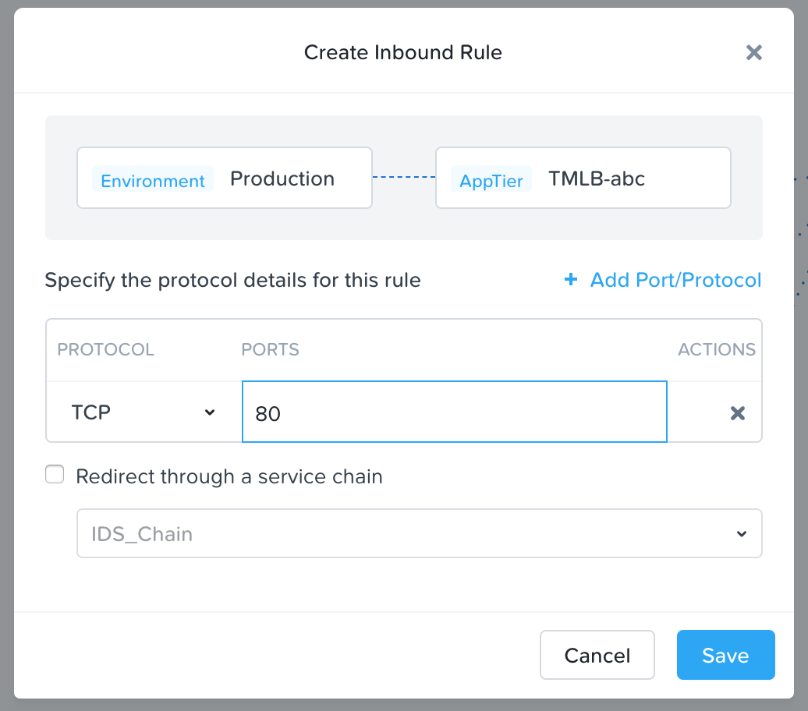

Add New Inbound Source for Calm
...............................

Calm requires access to log into newly provisioned VMs. Add Prism Central's IP address to the security policy.

- Select **+ Add Source**.
- Select **Add source by: Subnet/IP** using the drop down.
- Type the IP for Prism central followed by /32 to denote single IP in subnet mask slash notation. Example: 10.20.X.39/32. Click Add.

Click + which appears on the left side of **AppTier: TMLB-initials** after completing the steps above.

This opens the Create Inbound Rule window.

In the Protocol column, select **TCP** and type port 22 to allow Calm to access Linux VMs.

Click **+ Add Port/Protocol**. Select **TCP** and type port 5985 to allow Calm to access Windows VMs.

Click **Save**.

With the Prism Central Subnet/IP inbound connection selected, repeat this step for all remaining tiers to allow TCP port 22 from Calm.

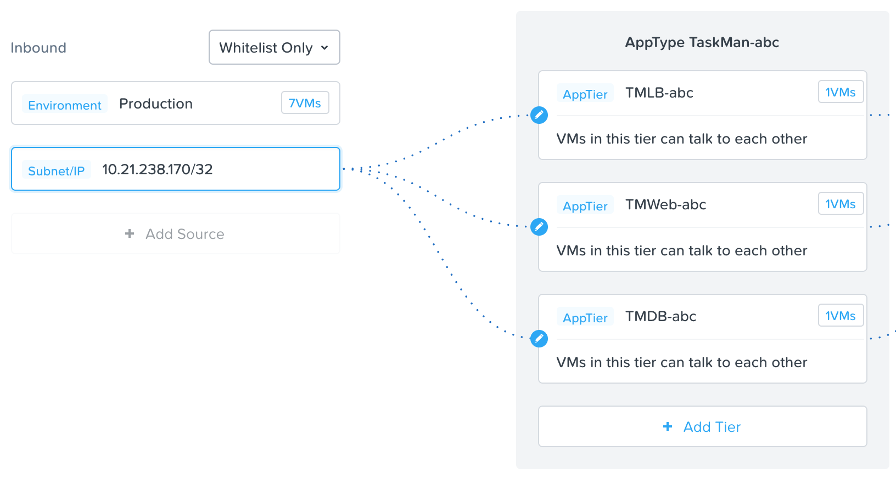

Add New Outbound Source
.......................

The newly provisioned VMs will need access to an external DNS server.

Change the outbound source from **Allow All** to **Whitelist Only**
- Select **+ Add Destination**.
- Select **Add destination by: Subnet/IP** using the drop down.
- Type enter the IP for DNS followed by /32. Example: 10.20.X.40/32. Click Add.

Click + which appears on the right side of **AppTier: TMDB-initials** after completing the steps above.

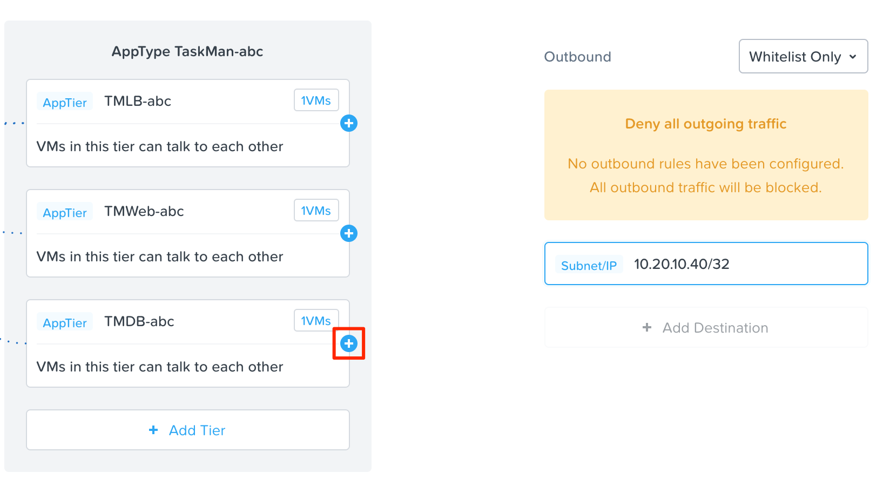

This opens the Create Outbound Rule window.

In the Protocol column, select **UDP** and type port 53.

Click **Save**.

Set Rules within Application
............................

Each tier of the application communicates with other tiers and the policy must allow this traffic. Some tiers such as the load balancer and web do not require communication within the same tier.

Click **Set Rules within App**

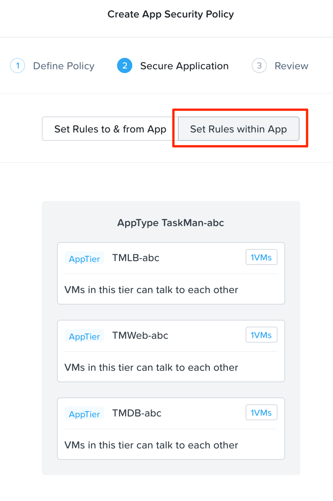

Select AppTier: TMLB-initials and click on "No" under the question to disallow communication between VMs within this tier.

With the AppTier: TMLB-initials selected, click on the + sign net to the AppTier: TMWeb-initials.

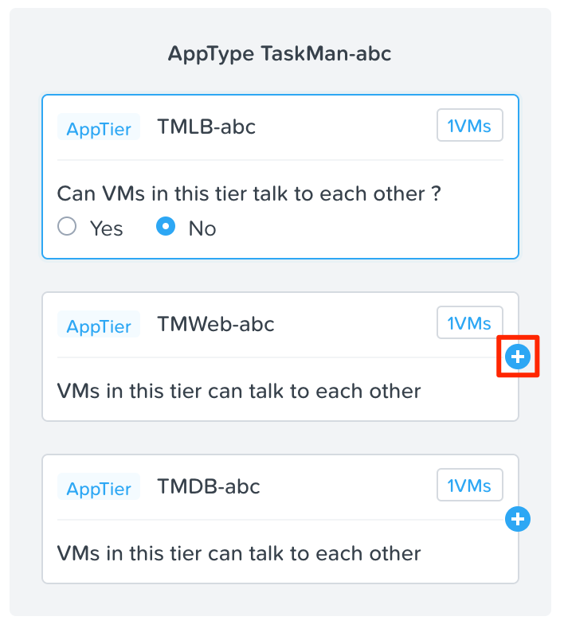

This opens the Create Tier to Tier Rule window.

In the Protocol column, select **TCP** and type port 80. Click **Save**.

Select AppTier: TMWeb-initials and click on "No" under the question to disallow communication between VMs within this tier.

With the AppTier: TMWeb-intials selected, click on the + sign net to the AppTier: TMDB-initials.

This opens the Create Tier to Tier Rule window.

In the Protocol column, select **TCP** and type port 3306. Click **Save**.

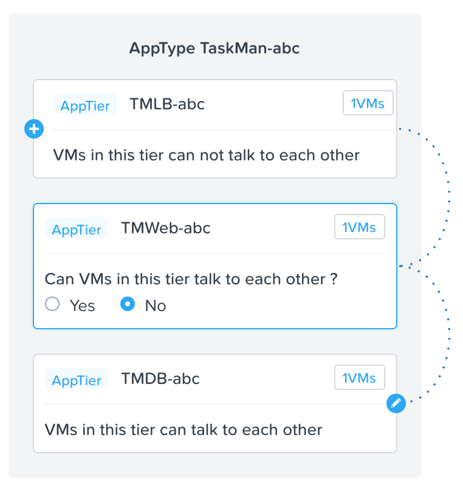

Click **Next**.

Click **Save and Monitor**.

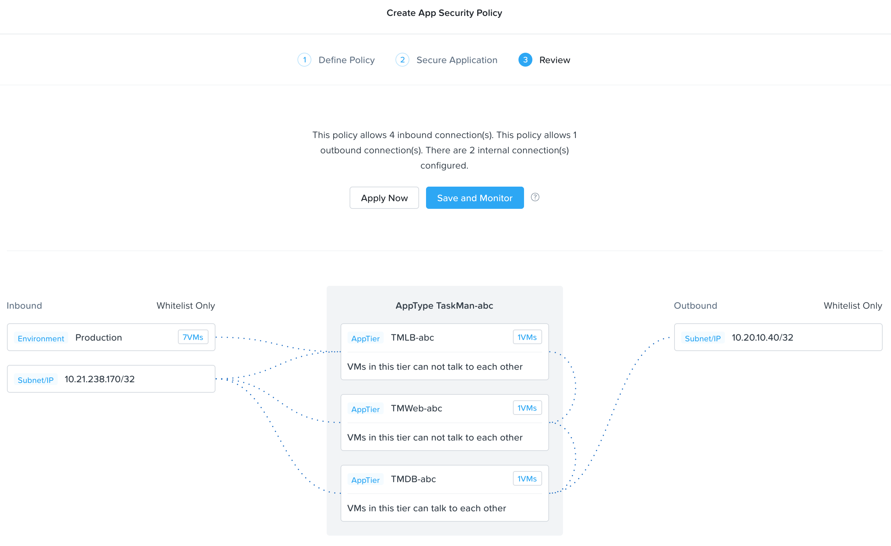

Takeaways
+++++++++

- Categories created in Prism Central are available inside Calm blueprints.
- Security policies leverage the text based categories in Prism Central.
- Flow can restrict traffic on certain ports and protocols for VMs running on AHV.
- The policy is created in **Save and Monitor** mode, meaning traffic is not actually blocked until the policy is applied. This is helpful to learn the connections and ensure no traffic is blocked unintentionally.
